# Mô hình


<p align="center">
  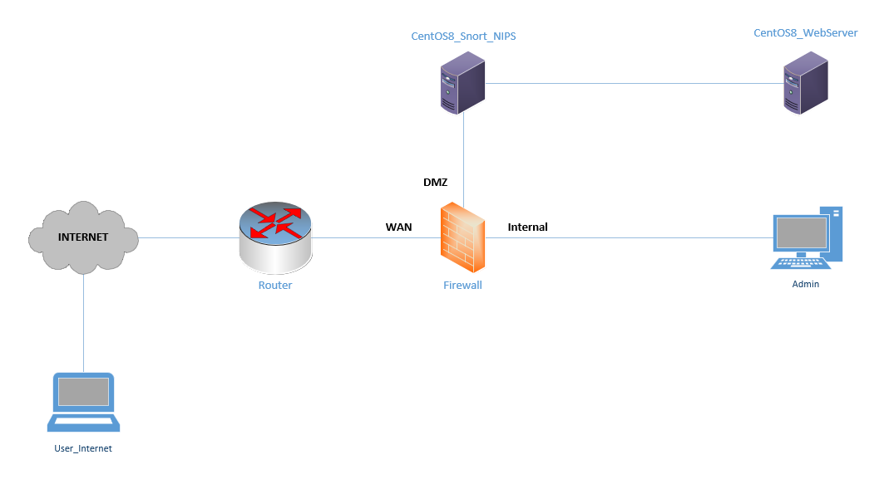
</p>


# Cài đặt
Cài đặt và cấu hình Snort phiên bản 2.9.x trên CentOS 8.
Cấu hình chế độ Inline cho Snort để chạy Snort như một NIPS.
Các package được cài đặt kèm theo:
- <b><u>Snort</b></u>: NIPS.
- <b><u>Barnyard2</b></u>: Phần mềm lấy output của Snort và ghi vào CSLD. Ở đây mình sẽ lưu vào hệ quản trị csdl MySql.
- <b><u>PulledPork</b></u>: tự động tải các Snort rule miễn phí mới nhất.
- <b><u>BASE</b></u>: giao diện đồ họa nền web viết bằng php, dùng để xem các Snort event.

**Lưu ý**: Toàn bộ đường dẫn để tải các file cần thiết ở dưới có thể bị chết hoặc thay thế trong tương lai.

## Kịch bản
Cấu hình NIPS sử dụng Snort để bảo vệ vùng DMZ của doanh nghiệp khỏi các tác nhân gây hại đi vào vùng này. Cấu hình Snort bảo vệ server trước cuộc tấn công "Ping of death". Cài đặt và thử nghiệm một số package của Snort. 

## <div id="install_snort">Cài đặt Snort</div>
*Lưu ý*: đảm bảo IPS phải kết nối được Internet
### <u>Bước 1: Cập nhập hệ thống.</u>
Cập nhập lại máy CentOS8 để đảm có thể chạy được các module mới nhất.
```sh
dnf update -y
```
Cài đặt thêm "epel-release" và "ethtool"
```sh
dnf install epel-release -y
dnf install ethtool -y
```

**NOTE**: Một số network card có tính năng gọi là "Large Receive Offload" (lro) và "Generic Receive Offload" (gro). khi kích hoạt tính năng này, network card thực hiện lắp ráp lại packet trước khi chúng được xử lý bởi kernel. mặc định, Snort sẽ xóa các packet lớn hơn default snaplen là 1518 bytes. Thêm vào đó, LRO, GRO có thể là nguyên nhân của vấn đề Stream5 target-based reassembly. Vì thế, nên tắt LRO và GRO.

Để tắt LRO và GRO ta sử dụng lệnh ethtool. Thêm 02 dòng sau vào mỗi interface.

```sh
ethtool -K ens33 gro off
ethtool -K ens34 lro off
```

Reset lại interface.
```sh
nmcli connection down $INTERFACE && nmcli connection up $INTERFACE
```


### <u>Bước 2: Cài đặt các thư viện cần thiết.</u>
Cài đặt các thư viên cần thiết để Snort hoạt động:
- pcap
- PCRE
- Libdnet
- DAQ

Cài đặt thêm một số công cụ cần thiết.
```sh
dnf install  gcc flex bison zlib* git libxml2 libpcap* pcre* tcpdump git libtool curl libdnet -y
dnf --enablerepo=powertools install libdnet-devel -y
dnf --enablerepo=powertools install libpcap-devel -y

# install daq
wget https://www.snort.org/downloads/snort/daq-2.0.7.tar.gz
tar -xvzf daq-2.0.7.tar.gz
cd daq-2.0.7
./configure
sudo make & make install
```
<!-- dnf groupinstall "Development Tools" -y # Không cần thiết -->
Cập nhật các đường dẫn thư viện:
```sh
echo /usr/lib >> /etc/ld.so.conf 
echo /usr/local/lib >> /etc/ld.so.conf
```

Tạo symbolic link cho libdnet
```sh
ln -s /usr/lib64/libdnet.so.1.0.1 /lib64/libdnet.1
```


### <u>Bước 3: Cài đặt Snort.</u>
- Cách 1:
```sh
dnf install https://www.snort.org/downloads/snort/snort-2.9.18-1.centos8.x86_64.rpm -y
```

- Cách 2:
```sh
wget https://www.snort.org/downloads/snort/snort-2.9.18-1.centos8.x86_64.rpm
dnf install snort-2.9.18-1.centos8.x86_64.rpm -y
```


- Cách 3:
```sh
wget https://www.snort.org/downloads/snort/snort-2.9.18.tar.gz
tar -xzvf snort-2.9.18.tar.gz
cd snort-2.9.18.tar.gz
./configure --enable-sourcefire
make && make install
```

Kiểm tra lại version của snort.

```sh
snort -V
```
**Lưu ý**: Link tải trên có thể bị thay đổi trong tương lai, kiểm tra link tải còn hoạt động không trước khi chạy các lệnh trên. Nếu không hợp lệ nữa thì thay thế bằng link hợp lệ.

### <u>Bước 4: Tạo các cấu trúc lưu trữ cho Snort.</u>
Tạo các thư mục cấu trúc cho việc lưu cấu hình Snort.
```sh
mkdir -p /etc/snort/rules
mkdir -p /var/log/snort
mkdir -p /usr/local/lib/snort_dynamicrules
```

Tạo các file cần thiết.
```sh
touch /etc/snort/rules/white_list.rules
touch /etc/snort/rules/black_list.rules
touch /etc/snort/rules/local.rules
touch /etc/snort/rules/snort.rules
touch /etc/snort/sid-msg.map
touch /var/log/snort/snort.log
```

Phân quyền cho các thư mục.
```sh
chmod -R 5775 /etc/snort
chmod -R 5775 /var/log/snort
chmod -R 5775 /usr/local/lib/snort_dynamicrules

chown -R snort:snort /etc/snort
chown -R snort:snort /var/log/snort
chown -R snort:snort /usr/local/lib/snort_dynamicrules
```
### <u>Bước 5: Cấu hình Snort chạy ở chế độ NIDS.</u>

Chỉnh sửa lại file cấu hình Snort (`/etc/snort/snort.conf`).
```sh
sed -i 's/include \$RULE\_PATH/#include \$RULE\_PATH/' /etc/snort/snort.conf
vi /etc/snort/snort.conf
```
 - Chỉnh sửa lại dòng 45. "any" thành địa chỉ vùng mạng muốn bảo vệ.
```sh
ipvar HOME_NET 192.168.1.0/24
```

- Chỉnh sửa lại dòng 48.
```sh
 ipvar EXTERNAL_NET !$HOME_NET
```
- Chỉnh sửa lại dòng 105 - 106 và 113 - 114.
```sh
var SO_RULE_PATH /etc/snort/so_rules
var PREPROC_RULE_PATH /etc/snort/preproc_rules
...
var WHITE_LIST_PATH /etc/snort/rules
var BLACK_LIST_PATH /etc/snort/rules
```
- Chỉnh sửa dòng 521, 546, 547.
```sh
 output unified2: filename snort.log, limit 128
 ...
 include $RULE_PATH/local.rules
 include $RULE_PATH/snort.rules
```
Kiểm tra tập tin cấu hình snort. Nếu ra "<u>Snort successfully validated the configuration!</u>" là đã thành công.
```sh
snort -T -c /etc/snort/snort.conf
```
### <u>Bước 6: Cấu hình chế độ Inline và NIPS cho Snort.</u>

Chỉnh sửa file cấu hình
```sh
vi /etc/snort/snort.conf
```

- Thêm vào dòng 188.
```sh
config policy_mode:inline
```

- Chỉnh sửa từ dòng 159 đến dòng 162

```sh
config daq: afpacket
onfig daq_dir: /usr/local/lib/daq
config daq_mode: inline
config daq_var: buffer_size_mb=1024
```
Kiểm tra tập tin cấu hình snort. Nếu ra "<u>Snort successfully validated the configuration!</u>" là đã thành công.
```sh
snort -c /etc/snort/snort.conf -i ens33:ens34 -T -Q
```
**Lưu ý**: option -i các bạn thay thế 2 interface thích hợp của máy vào.

## Thực nghiệm, kiểm tra hoạt động của Snort.
Chúng ta tiến hành ping liên tục với khối dữ liệu lớn vào server. tháy thế $IP_SERVER bằng địa chỉ IPv4 của server.
```sh
ping $IP_SERVER -l 20000
```

Truy cập tập tin local.rules.
```sh
vi /etc/snort/rules/local.rules
```
Thêm nội dung rule vào tập tin local.rules
```sh
drop icmp any any -> $HOME_NET any (msg:"--> Ping of death attack!"; dsize:>10000; gid:1000001; sid:1000001; rev:1;)
```
Thêm cấu sau vào tập tin `/etc/snort/sid-msg.map` để bật trigger cảnh báo.
```sh
1 || 10000001 || 001 || icmp-event || 0 || ICMP Test detected || url,tools.ietf.org/html/rfc792
```

Chạy lệnh giam sát snort trên console và theo dõi
```sh
snort -c /etc/snort/snort.conf -i ens33:ens34 -A console -Q -u snort -g snort -q
```
<p align="center">
  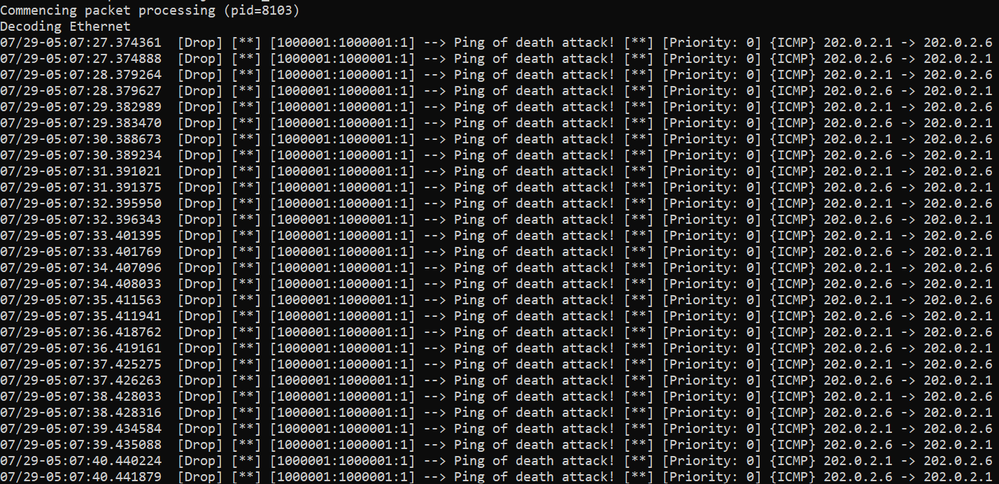
</p>

Ngăn chặn thành công cuộc tấn công "Ping of death".

## Cài đặt `Barnyard2` cho Snort.
### <u>Bước 1: Cài đặt cơ sở dử liệu mysql.</u>
Ở đây mình dùng hệ quản trị cơ sở dữ liệu mysql.
```sh
dnf install mariadb-server mysql-libs mysql-devel -y
# Start and enable mariadb-sever
systemctl enable mariadb.service --now
```
### <u>Bước 2: Tải, cài đặt và cấu hình "Barnyard2".</u>
```sh
wget https://github.com/firnsy/barnyard2/archive/master.tar.gz
tar -xzvf master.tar.gz
cd barnyard2-master/
./autogen.sh && ./configure --with-mysql --with-mysql-libraries=/usr/lib64/mysql && make && make install # Xem sửa lỗi ở dưới
cp -v etc/barnyard2.conf /etc/snort/
```

<b style="color: red; font-size: 15px">Sửa lỗi:</b>


Nếu gặp lỗi:
```
spo_alert_fwsam.c:118:13: error: two or more data types in declaration specifiers 
typedef int SOCKET;
```
- Thì vào file `src/output-plugins/spo_alert_fwsam.c` thay các biến `SOCKET` thành `BAR2_SOCKET` hoặc dùng lệnh này ``sed -i 's/[^_]SOCKET/ BAR2_SOCKET/g' src/output-plugins/spo_alert_fwsam.c``
<br>

Nếu gặp lỗi:

```
../output-plugins/spo_database.h:360:5: error: unknown type name ‘my_bool’
     my_bool mysql_reconnect; /* We will handle it via the api. */
```
- Thì vào file `src/output-plugins/spo_database.h` thay biến `my_bool` ở dòng 360 thành `bool` hoặc dùng lệnh này ``sed -i 's/my_bool/bool/g' src/output-plugins/spo_database.h``

Kiểm tra xem cài đặt thành công chưa.
```sh
barnyard2 -V
```
Truy cập file cấu hình barnyard2.

```sh
vi /etc/snort/barnyard2.conf
```

Tạo cấu trúc lưu trữ cho barnyard2.
```sh
mkdir /var/log/barnyard2
chown -R snort:snort /var/log/barnyard2
touch /var/log/snort/barnyard2.waldo
chown snort:snort /var/log/snort/barnyard2.waldo
```

Truy cập file cấu hình snort và điều chỉnh lại dòng 521.
```sh
vi /etc/snort/snort.conf
...
output unified2: filename snort.u2, limit 128
```

### <u>Bước 3: Tạo cơ sở dữ liệu.</u>
```sh
mysql -u root -p

MariaDB [(none)]> create database snort;
MariaDB [(none)]> use snort;
MariaDB [snort]> source ~/barnyard2-master/schemas/create_mysql; # Đường dẫn tới barnyard2
MariaDB [snort]> CREATE USER 'snort'@'localhost' IDENTIFIED BY '123456';
MariaDB [snort]> grant create, insert, select, delete, update on snort.* to 'snort'@'localhost'; 
```

Khai báo thông tin csdl.
```sh
echo 'output database: log, mysql, user=snort password=123456 dbname=snort host=localhost sensor name=sensor01' >> /etc/snort/barnyard2.conf
```
### <u>Bước 4: Kiểm tra.</u>
Thực hiện tấn công "Ping of death".
Chạy Snort
```sh
snort -c /etc/snort/snort.conf -i ens33:ens34 -Q -u snort -g snort -q
```

Chạy barnyard2.
```sh
barnyard2 -c /etc/snort/barnyard2.conf -d /var/log/snort -f snort.u2 -w /var/log/snort/barnyard2.waldo -g snort -u snort
```

Khi ra kết quả như ảnh dưới là đã thành công.
<p align="center">
  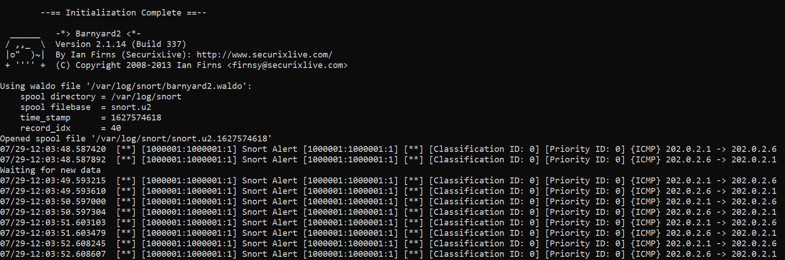
</p>

Kiểm tra cơ sở dữ liệu.
```sh
mysql -u snort -p -D snort -e "select * from event"
Password:123456
```
<p align="center">
  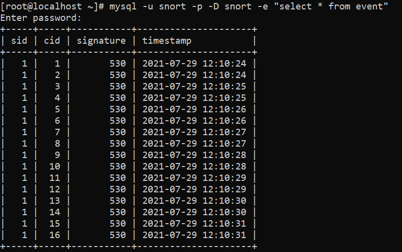
</p>

## Cài đặt "PulledPork" cho Snort.
**Lưu ý**: Bạn cần tạo một tài khoản trên https://snort.org/ để có oinkcode để tải về những rule mới nhất.
### <u>Bước 1: Tải và cài đặt PulledPork.</u>
Cài đặt các gói cần thiết
```sh
dnf install perl-libwww-perl perl-core -y
```
Tải và cài đặt
```sh
git clone https://github.com/shirkdog/pulledpork.git
cd pulledpork/
cp pulledpork.pl /usr/local/bin
chmod +x /usr/local/bin/pulledpork.pl
cp etc/*.conf /etc/snort
```

Tạo cấu lưu trữ.
```sh
mkdir /etc/snort/rules/iplists
touch /etc/snort/rules/iplists/default.blacklist
touch /etc/snort/rules/iplists/default
chown -R snort:snort /etc/snort/rules/iplists
```

Kiểm tra pulledpork đã cài đặt thành công
```sh
pulledpork.pl -V
```

### <u>Bước 2: Cấu hình PulledPork.</u>
Truy cập file `/etc/snort/pulledpork.conf`

```sh
vi /etc/snort/pulledpork.conf
```

- CHỉnh sửa dòng 19. `<oinkcode>` đổi thành oinkcode của bạn.
```vim
 rule_url=https://www.snort.org/reg-rules/|snortrules-snapshot.tar.gz|d98f4a3c88axxxxxxxxxxxxxxxxxxxxxxxxxxxxxxxxxxxxxxxx
```

- Command dòng 21.

- Thay đổi dòng 72.
```vim
rule_path=/etc/snort/rules/snort.rules
```

- Thay đổi dòng 87.
```vim
local_rules=/etc/snort/rules/local.rules
```
- Thay đổi dòng 90.
```vim
sid_msg=/etc/snort/sid-msg.map
```

- Thay đổi dòng 113.
```vim
snort_path=/usr/sbin/snort
```
- Thay đổi dòng 117.
```vim
config_path=/etc/snort/snort.conf
```
- Thay đổi dòng 134.
```vim
distro=Centos-8
```
- Thay đổi dòng 142.
```vim
/etc/snort/rules/iplists/default.blacklist
```
- Thay đổi dòng 151.
```vim
IPRVersion=/etc/snort/rules/iplists
```

- Bỏ Command dòng 200 đến 203.
```vim
enablesid=/etc/snort/enablesid.conf
dropsid=/etc/snort/dropsid.conf
disablesid=/etc/snort/disablesid.conf
modifysid=/etc/snort/modifysid.conf
```

Kiểm tra xem thành công không. Nếu không xuất hiện  `Error` là thành công.
```sh
pulledpork.pl -c /etc/snort/pulledpork.conf
```
### <u>Bước 3: Sử dụng PulledPork.</u>
Chạy lệnh dưới để sử dụng.
```sh
pulledpork.pl -c /etc/snort/pulledpork.conf -l
```

Truy cập file `/etc/snort/rules/snort.rules` để xem rule đã được cập nhập chưa.

### <u>Bước 4: Đặt lịch để PulledPork cập nhật.</u>
```sh
crontab -e
# thêm vào crontab dòng sau để chỉ định cập nhật 5 phút mỗi lần
* */5 * * * pulledpork.pl -c /etc/snort/pulledpork.conf -l
```

## Cấu hình tự động khởi động cùng Hệ thống.

Khi bạn khởi động lại HĐH, bạn muốn Snort và Barnyard2 khởi động cùng thì cần cấu hình như sau.

Mở file `/lib/systemd/system/snort.service` và thêm nội dung sau vào, lưu ý thay interface mong muốn
```sh
[Unit]
Description=Snort NIDS Daemon
After=syslog.target network.target

[Service]
Type=simple
ExecStart=snort -q -u snort -g snort -c /etc/snort/snort.conf -i ens33:ens34 -Q

[Install]
WantedBy=multi-user.target
```

Chạy lệnh sau để báo systemD bật khi khởi động
```sh
systemctl enable snort
```

Khởi động service
```sh
systemctl start snort
```

Tiếp tục cấu hình cho Barnyard2 bằng cách tạo file `vi /lib/systemd/system/barnyard2.service` và thêm nội dung sau:
```sh
[Unit]
Description=Barnyard2 Daemon
After=syslog.target network.target

[Service]
Type=simple
ExecStart=barnyard2 -c /etc/snort/barnyard2.conf -d /var/log/snort -f snort.u2 -q -w /var/log/snort/barnyard2.waldo -g snort -u snort -D

[Install]
WantedBy=multi-user.target
```

Báo cho systemD khởi động barnyard2 khi khởi động và khởi động lại barnyard2
```sh
systemctl enable barnyard2 --now
```

## Cài đặt "BASE" cho Snort.
### <u>Bước 1: Cài đặt các gói cần thiết.</u>
```sh
dnf install httpd php* -y
```

Khởi động httpd 
```sh
firewall-cmd --add-service=http --permanent
firewall-cmd --reload
systemctl enable httpd.service --now
```

### <u>Bước 2: Tải Source Code BASE.</u>
Tải và copy source vào thư mục html
```sh
git clone https://github.com/loveyuki147/base1.4.5
cp -r base1.4.5/ /var/www/html/base
chown -R apache:apache /var/www
```

### <u>Bước 3: Tải Source Code ADODB.</u>
Tải và copy source vào thư mục html.
```sh
git clone https://github.com/ADOdb/ADOdb
cp -r ADOdb/ /var/www/html/adodb
chown -R apache:apache /var/www
```
### <u>Bước 4: Cấu hình BASE.</u>

Truy cập file `/etc/php.ini`

- Sửa dòng 460.
```vim
error_reporting = E_ALL & ~E_NOTICE
```
Chạy lại php để php nhận lại cấu hình.
```sh
systemctl restart php-fpm.service
```
Truy cập theo địa chỉ  `http://IP/base/` của máy Snort.
Bấm `continue`.
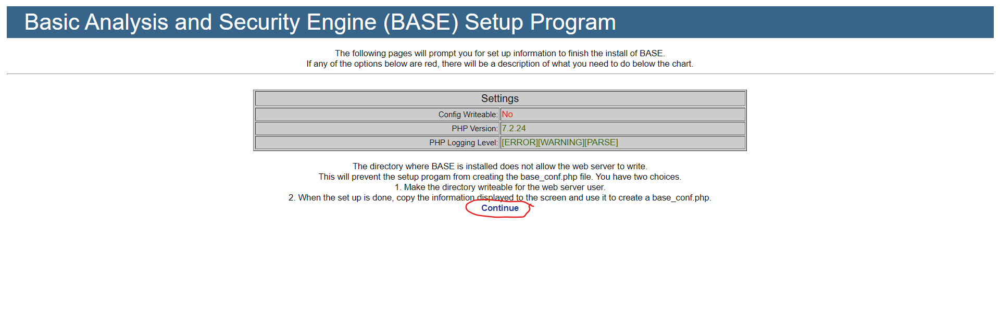

Tiếp tục nhập dữ liệu như hình dưới
- Pick a Language: Lựa chọn ngôn ngữ phù hợp.
- Path to ADODB: Đường dẫn tới ADODB.
- Bấm `Continue` để tiếp tục
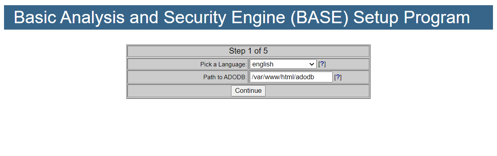

Tiếp tục nhập dữ liệu như hình dưới
- Pick a Database type:	 Lựa chọn hệ quạn trị csdl.
- Database Name: Tên Database ta đã tạo lúc cài đặt `Barnyard2`.
- Database User Name: Username của Database Tương tự như lúc cài `Barnyard2`.
- Database Password: Password của Username `snort` Tương tự như lúc cài `Barnyard2`.
- Bấm `Continue` để tiếp tục
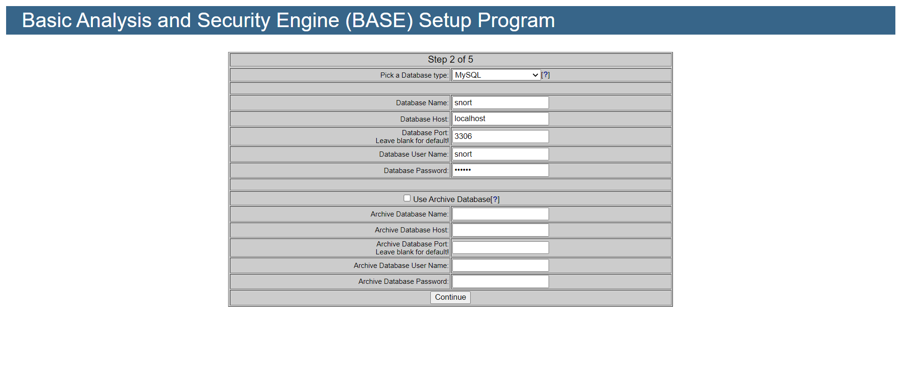

Tiếp tục nhập dữ liệu như hình dưới
- Admin User Name: Username của người quản trị.
- Password:	Mật khẩu của người quản trị.
- Full Name: Tên người quản trị.
- Bấm `Continue` để tiếp tục
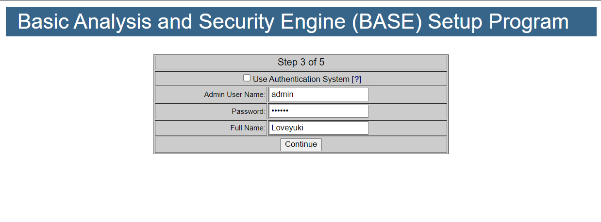

Tiếp tục nhập dữ liệu như hình dưới
- Admin User Name: Username của người quản trị.
- Password:	Mật khẩu của người quản trị.
- Full Name: Tên người quản trị.
- Bấm `Continue` để tiếp tục


Làm theo các bước dưới:
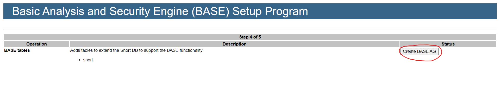
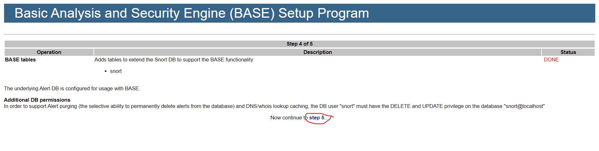

Copy toàn bộ code php ở dưới vào tập tin `/var/www/base/base_conf.php`. Nhớ set cho nó thuộc quyền sở hữu của apache
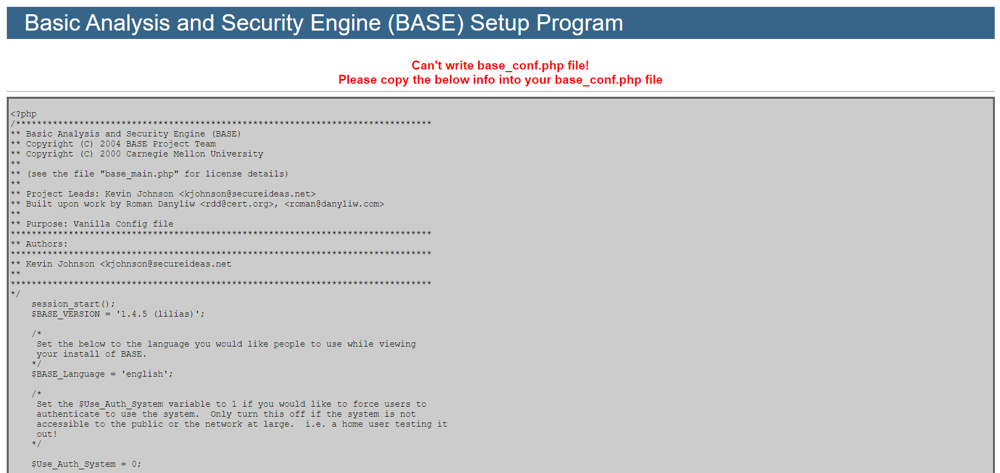

<br>


#### Truy cập lại đường dẫn `http://IP/base/`. Ta có thể thấy giao diện BASE đã xuất hiện.


# Tham khảo
- <a>https://programmersought.com/article/61256098977/</a>


