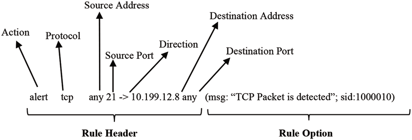
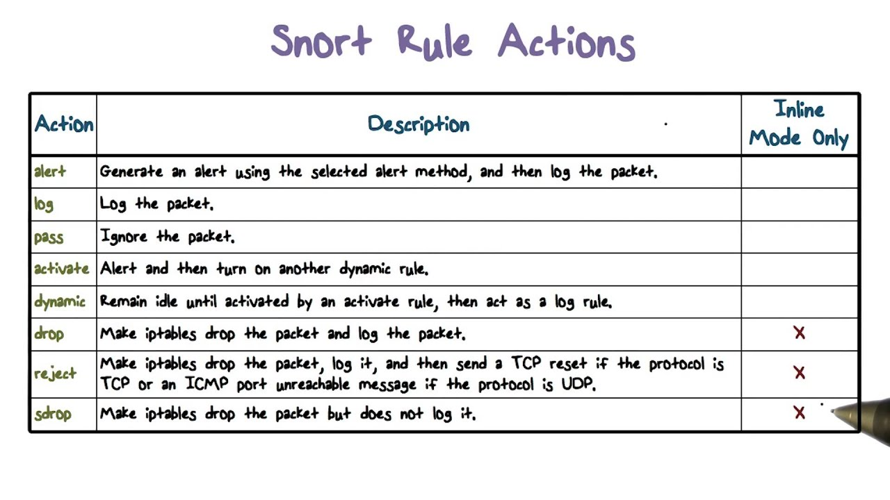

# Bộ luật của Snort

<p align="center">
  
</p>

Module detection engine sử dụng các bộ luật (rules) để nhận dạng các loại dữ liệu khác nhau.

Cấu trúc của một rule được chia thành 02 phần:

- <b><u>Phần Header</u></b>: cung cấp các thông tin về hành động muốn thao tác với gói tin; IP, port nguồn\đích; giao thức của gói tin

- <b><u>Phần Option</u></b>: Chứa thông điệp thông báo và các thông tin về các phần của gói tin dùng lọc các gói tin này theo ý muốn của người viết.

## Cấu trúc phần header

| Action | Protocol | Address | Port | Direction | Address | Port |

Ví dụ: 
```sh
| alert | tcp | 202.0.2.0/24 | any | -> | $HOME_NET | 23 |
```


### Action
Là phần quy định loại hành động nào được thực thi. Thông thường các hành động tạo ra một cảnh báo hoặc log thông điệp hay kích hoạt một luật khác
Trong Snort, có 05 action được định nghĩa:
- <b><u>Pass</u></b>:     Cho các gói tin đi qua.
- <b><u>Log</u></b>:      Dùng để ghi lại log gói tin.
- <b><u>Alert</u></b>:    Gửi thông điệp cảnh báo.
- <b><u>Drop</u></b>:     Đánh rớt  gói tin và ghi lại log, không phản hồi lại.
- <b><u>Reject</u></b>:   Đánh rớt  gói tin, ghi lại log, có phản hồi lại - gửi lại gói TCP Reset nếu là giao thức TCP.
- <b><u>Activate</u></b>: Tạo ra cảnh báo và kích hoạt thêm các luật khác để kiểm tra thêm điều kiện của gói tin
- <b><u>Dynamic</u></b>:  Đây là luật được gọi bởi các luật khác có Action khai báo là Activate





### Protocol

Chỉ ra các loại gói tin mà rule được áp dụng:
- IP
- ICMP
- TCP
- UDP


### Address

Có 02 phần là địa chỉ đích và địa chỉ nguồn. Nó có thể là một IP đơn hoặc 1 dải mạng. Nếu là "any" thì áp dụng cho tất cả các địa chỉ trong mạng. 
Chú ý: Nếu là một host thì có dạng: ipaddress/subnet_mark. Ví dụ: 202.0.2.0/24

Snort cung cấp phương pháp để loại trừ địa chỉ IP bằng cách sử dụng dấu "!". Ví dụ: 
```sh
alert icmp ![202.0.2.0/24] any -> any any (msg: "Ping with TTL=100"; ttl: 100;)
```

*Lưu ý*: dấu "[]" chỉ cần dùng khi đằng trước có "!"

### Port

Số port để áp dụng cho các rule. Ví dụ telnet 23, DNS 53,... Port chỉ áp dụng cho 02 giao thức là TCP và UDP

Để sử dụng một dãy các port thì ta phân biệt bởi dấu ":". Ví dụ 
```sh
alert udp any 1024:8080 -> any any (msg: "UDP port";)
```

### Direction

Chỉ ra đâu là nguồn, đâu là đích. có thể là -> hoặc <- hoặc <> 

Trường hợp <> là khi ta muốn kiểm tra Client và Server.

## Phần Option

Phần Option nằm ngay sau phần Header và được bao bọc trong dấu ngoặc đơn. Nếu có nhiều Option thì sẽ phân biệt bởi dấu chấm phẩy ";". 
Một Option gồm có 2 phần: một là từ khóa và một là tham số. 02 phần này sẽ phân cách nhau bằng dấu hai chấm ":"
Một từ khóa cũng có thể có nhiều tham số.

## Một số option

### Từ khóa "content"

Một đặc tính quan trọng của Snort là có khả năng tìm một mẫu dữ liệu bên trọng một gói tin.

Ví dụ:
```sh
alert tcp 192.168.0.0/22 any -> ![192.168.0.0/22] any (content: "GET"; msg :"GET match";)
```

Rule trên tìm mẫu "GET" trong phần dữ liệu của tất cả gói tin TCP có nguồn mạng là 192.168.0.0/22 đi đến các địa chỉ đích không nằm trong dải mạng đó.

Tuy nhiên khi sử dụng từ khóa content cần nhớ rằng:
- Đối chiếu nội dung cần phải xử lý rất lớn nên ta phải cân nhắc kỹ khi sử dụng nhiều luật đối chiếu nội dung.

Các từ khóa được áp dụng cùng với content để bổ sung thêm các điều kiện là:
- Offset: dùng để xác định vị trí bắt đầu tìm kiếm là offset tính từ đầu phần dữ liệu của gói tin.
Ví dụ:
```sh
alert tcp 202.0.2.0/24 any -> any any (content: "HTTP"; offset: 4; msg: "HTTP matched";)
```
- Dept: dùng để xác định vị trí mà từ đó Snort sẽ dừng việc tìm kiếm. VD sau sẽ tìm 10 byte đầu tiên của content
```sh
alert tcp 202.0.2.0/24 any -> any any (content: "HTTP"; dept: 10; msg: "HTTP matched";)
```


### Từ khóa "pcre"
Từ khóa pcre cho phép các quy tắc được viết bằng cách sử dụng các biểu thức chính quy (Regular Expression - Regex) tương thích với perl. Để biết thêm chi tiết về những gì có thể được thực hiện thông qua biểu thức chính quy pcre, hãy xem trang web PCRE <a>http://www.pcre.org</a>

```sh
alert tcp $EXTERNAL_NET any -> $HTTP_SERVERS $HTTP_PORTS (msg:"SQL Injection";pcre:"/(\%27)|(\')|(\-\-)|(%23)|(#)/i"; classtype:Web-application-attack; sid:9099; rev:5;)
```

Rule trên nhằm tìm ra phần payload dùng để tấn công SQL injection bằng mẫu Regex.

### Từ khóa "ACK"

Trong header TCP có chứa trường Acknowledgement Number với độ dài 32 bit. Trường này chỉ ra số thứ tự tiếp theo gói tin TCP của bên gửi đang chờ để nhận. Trường này chỉ có ý nghĩa khi mà cờ ACK được thiết lập.

Ví dụ: gửi gói tin TCP tới cổng 80 với cờ ACK được bật và số thứ tự là 0, bên nhận sẽ thấy gói tin không hợp lệ và gửi lại gói tin RST. 
Khi nhận được gói RST này, công cụ ping sẽ biết được IP này đang tồn tại hay không.

Để kiểm tra loại ping TCP này thì ta có thể dùng luật sau:
```sh
Alert tcp any any -> 192.168.0.0/22 any (flags: A; ack: 0; msg: "TCP ping detected")
```

### Từ khóa "classtype"

Các luật có thể được phân loại và gán cho một số chỉ độ ưu tiên nào đó để nhóm và phân biệt chúng với nhau. Để hiểu rõ hơn về classtype thì 
ta cần hiểu được file classification.config. Mỗi dòng trong file này đều có cấu trúc như sau: Config classification: name, description, priority

Trong đó:
- Name: tên dùng để phân loại, tên này sẽ được dùng với từ khóa classtype trong các luật Snort.
- Description: Mô tả
- Priority: là một chỉ số chỉ độ ưu tiên mặc định của lớp này. Độ ưu tiên này có thể được điều chỉnh trong từ khóa priority của phần Option trong Snort

Ví dụ:
```sh
Config classification: DoS, Denied of Service Attack, 2
```

Và luật:
```sh
Alert udp any any -> 192.168.0.0/22 6838 (msg:"DoS"; content: "server"; classtype: DoS; priority: 1;)
```

để ghi đè lên giá trị priority mặc định của lớp đã định nghĩa.


### Từ khóa "dsize"

Dùng để so sánh độ lớn của phần dữ liệu trong mỗi gói tin. Rất nhiều cuộc tấn công sử dụng lỗi tràn bộ nhớ đệm bằng cách gửi các gói tin có kích thước rất lớn.
Ví dụ:
```sh
alert icmp any any -> $HOME_NET any (dsize > 10000; msg: "Ping of death!!!";)
```

### Từ khóa "flags"

Từ khóa này dùng để phát hiện xem những bit cờ  nào được bật trong phần TCP header của gói tin. Mỗi cờ có thể được sử dụng như 
1 tham số trong từ khóa flags


<table border="2" cellspacing="2" cellpadding="2">
   <thead>
      <tr valign="TOP">
         <th align="center" valign="top">
            <p><font size="-1"><b>Flag</b></font></p>
         </th>
         <th align="center" valign="top">
            <p><font size="-1"><b>Argument character used in Snort rules</b></font></p>
         </th>
      </tr>
   </thead>
   <tbody>
      <tr valign="TOP">
         <td>
            <p><font size="-1">FIN or Finish Flag</font></p>
         </td>
         <td>
            <p><font size="-1">F</font></p>
         </td>
      </tr>
      <tr valign="TOP">
         <td>
            <p><font size="-1">SYN or Sync Flag</font></p>
         </td>
         <td>
            <p><font size="-1">S</font></p>
         </td>
      </tr>
      <tr valign="TOP">
         <td>
            <p><font size="-1">RST or Reset Flag</font></p>
         </td>
         <td>
            <p><font size="-1">R</font></p>
         </td>
      </tr>
      <tr valign="TOP">
         <td>
            <p><font size="-1">PSH or Push Flag</font></p>
         </td>
         <td>
            <p><font size="-1">P</font></p>
         </td>
      </tr>
      <tr valign="TOP">
         <td>
            <p><font size="-1">ACK or Acknowledge Flag</font></p>
         </td>
         <td>
            <p><font size="-1">A</font></p>
         </td>
      </tr>
      <tr valign="TOP">
         <td>
            <p><font size="-1">URG or Urgent Flag</font></p>
         </td>
         <td>
            <p><font size="-1">U</font></p>
         </td>
      </tr>
      <tr valign="TOP">
         <td>
            <p><font size="-1">Reserved Bit 1</font></p>
         </td>
         <td>
            <p><font size="-1">1</font></p>
         </td>
      </tr>
      <tr valign="TOP">
         <td>
            <p><font size="-1">Reserved Bit 2</font></p>
         </td>
         <td>
            <p><font size="-1">2</font></p>
         </td>
      </tr>
      <tr valign="TOP">
         <td>
            <p><font size="-1">No Flag set</font></p>
         </td>
         <td>
            <p><font size="-1">0</font></p>
         </td>
      </tr>
   </tbody>
</table>

Ví dụ: luật sau đây sẽ phát hiện một hành động quét dùng gói tin SYN-FIN:
```sh
Alert tcp any any -> 192.168.0.0/22 any (flags: SF; msg: "SYNC-FIN flag detected";)
```

### Từ khóa "flagbits"

Phần IP header của gói tin chứa 03 bit dùng để chống phân mảnh và tổng hợp các gói tin IP. Các bit đó là:
- Reversed bit (RB): dùng để dành cho tương lai)
- Don't Fragment Bit (DF): nếu bit này được thiết lập tức là gói tin không bị phân mảnh
- More Fragments Bit (MF): nếu được thiết lập thì các phần khác của gói tin vẫn đang trên đường đi mà chưa tới đích.
Nếu bit này không được thiết lập thì đây là phần cuối cùng của gói tin.

Ví dụ: luật sau sẽ phát hiện xem bit DF trong gói tin ICMP có được bật hay không:
```sh
alert icmp any any -> 192.168.0.0/22 any (fragbits: D; msg: "Don’t Fragment bit set";)
```

### Từ khóa "itype"

Chỉ kiểu của gói tin ICMP. ví dụ trong trường hợp sau `itype: 8` tức là một gói tin ICMP có kiểu echo request
```sh
alert icmp !$HOME_NET any -> $HOME_NET any (msg:"IDS152 - PING BSD"; 
content: "|08 09 0a 0b 0c 0d 0e 0f 10 11 12 13 14 15 16 17|"; itype: 8;
depth: 32;)

```


# Tham khảo

- <a>https://github.com/hocchudong/ghichep-IDS-IPS-SIEM/tree/master/ghichep-snort</a>
- <a>https://paginas.fe.up.pt/~mgi98020/pgr/writing_snort_rules.htm</a>
