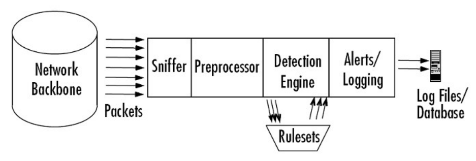
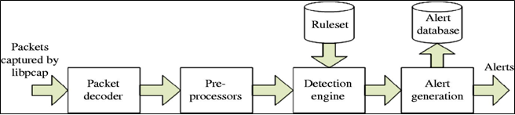

# Snort là gì?

  

- Snort là một hệ thống IPS mã nguồn mở và hoàn toàn miễn phí, thực hiện giám sát các gói tin ra vào hệ thống và ngăn chặn những tác động ảnh hưởng tới hệ thống.

- Snort sử dụng một loạt các rule giúp xác định hoạt động độc hại trên mạng và sử dụng các rule đó để tìm các gói phù hợp với chúng và tạo cảnh báo cho người dùng. Các rule này người dùng có thể tự định nghĩa.

- Snort cũng có thể được triển khai nội tuyến (inline). Snort có ba mục đích sử dụng chính: Như một trình dò ​​tìm gói tin như tcpdump, như một trình ghi gói tin - hữu ích cho việc gỡ lỗi lưu lượng mạng hoặc nó có thể được sử dụng như một hệ thống ngăn chặn xâm nhập mạng (IPS) toàn diện. Snort có thể được tải xuống và định cấu hình để sử dụng cho cá nhân và doanh nghiệp.

# Chế độ của snort.

Snort có ba chế độ khác nhau:
- Packet Sniffer
- Packet Logger
- NIPS/NIDS

# Kiến trúc của Snort

  

  

Trong mô hình kiến trúc trên, hệ thống Snort được chia thành 4 phần:

- Module Decoder
- Module Preprocessors
- Module Detection Engine
- Module Logging and Alerting System

## Module Decoder

Các gói dữ liệu đi vào qua các cổng giao tiếp mạng, các cổng giao tiếp này có thể là: Ethernet, SLIP, ppp... Và được giải mã bởi packet decoder, trong đó xác định giao thức được sử dụng cho gói tin và dữ liệu phù hợp với hành vi được cho phép của phần giao thức của chúng. Packet Decoder có thể tạo ra các cảnh báo riêng của mình dựa trên phần header của giao thức, các gói tin quá dài, bất thường hoặc không chính xác các tùy chọn TCP được thiết lập trong phần header. Có thể kích hoạt hoặc vô hiệu hóa các cảnh báo dài dòng cho tất cả các trường trong tập tin snort.conf.

Snort sử dụng thư viện pcap để bắt mọi gói tin trên mạng lưu thông qua hệ thống. Gói tin sau khi được giải mã sẽ đưa vào Module tiền xử lý.

<!--  -->

## Module Preprocessors

Module này rất quan trọng đối với bất kỳ hệ thống nào để có thể chuẩn bị gói dữ liệu đưa vào cho Module phát hiện phân tích. 03 nhiệm vụ chính

- Kết hợp lại các gói tin: Khi một dữ liệu lớn được gửi đi, thông tin sẽ không đóng gói toàn bộ vào một gói tin mà thực hiện phân mảnh, chia thành nhiều gói tin rồi mới gửi đi. Khi Snort nhận được các gói tin này, nó phải thực hiện kết nối lại để có gói tin ban đầu.Module tiền xử lý giúp Snort có thể hiểu được các phiên làm việc khác nhau.

- Giải mã và chuẩn hóa giao thức (decode/normalize): cCông việc phát hiện xâm nhập dựa trên dấu hiệu nhận dạng nhiều khi thất bại 
khi kiểm tra các giao thức có dữ liệu có thể được biểu diễn dưới nhiều dạng khác nhau. Ví dụ: một Web server có thể nhận nhiều dạng URL: 
URL viết dưới dạng hexa/unicode hay URL chấp nhận dấu / hay \. Nếu Snort chỉ thực hiện đơn thuần việc so sánh dữ liệu với dấu hiệu 
nhận dạng sẽ xảy ra tình trạng bỏ sót hành vi xâm nhập. Do vậy, 1 số Module tiền xử lý của Snort phải có nhiệm vụ giải mã và chỉnh sửa, 
sắp xếp lại các thông tin đầu vào.

- Phát hiện các xâm nhập bất thường (nonrule/anormal):các plugin dạng này thường để xử lý với các xâm nhập không thể hoặc rất khó 
phát hiện bằng các luật thông thường. Phiển bản hiện tại của Snort có đi kèm 2 plugin giúp phát hiện xâm nhập bất thường đó là portscan 
và bo (backoffice). Portscan dùng để đưa ra cảnh báo khi kẻ tấn công thực hiện quét cổng để tìm lỗ hổng. Bo dùng để đưa ra cảnh báo khi 
hệ thống nhiễm trojan backoffice.

## Module Detection Engine

Đây là module quan trọng nhất của Snort. Nó chịu trách nhiệm phát hiện các dấu hiệu xâm nhập. Module sử dụng các luật (rule) được 
định nghĩa từ trước để so sánh với dữ liệu thu thập được, từ đó xác định xem có xâm nhập xảy ra hay không.

Một vấn đề quan trọng đối với module detection engine là thời gian xử lý gói tin: một IDS thường nhận rất nhiều gói tin và bản thân nó cũng 
có rất nhiều luật xử lý. Khi lưu lượng mạng quá lớn thì có thể xảy ra việc bỏ sót hoặc không phản hồi đúng lúc. Khả năng xử lý của module 
phát hiện phụ thuộc vào nhiều yếu tố: số lượng các luật, tốc độ hệ thống, băng thông mạng

Module detection engine có khả năng tách các phần của gói tin ra và áp dụng luật lên tưng phần của gói tin:
- IP header
- Header ở tầng transport: TCP, UDP
- Header ở tầng application: DNS, HTTP, FTP,...
- Phần tải (payload) của gói tin

Do các luật trong Snort được đánh số thứ tự ưu tiên nên một gói tin khi bị phát hiện bởi nhiều luật khác nhau, cảnh báo được đưa ra 
theo luật có mức ưu tiên cao nhất.

## Module log và cảnh báo

Tùy thuộc vào module phát hiện (detection engine) có nhận dạng được xâm nhập hay ko mà gói tin có thể bị ghi log hay đưa ra cảnh báo. 
Các file log là các file dữ liệu có thể ghi dưới nhiều định dạng khác nhau như tcpdump, xml, syslog, log file.

# Tham khảo

- <a>https://github.com/hocchudong/ghichep-IDS-IPS-SIEM/tree/master/ghichep-snort</a>
- <a>https://www.snort.org/</a>
